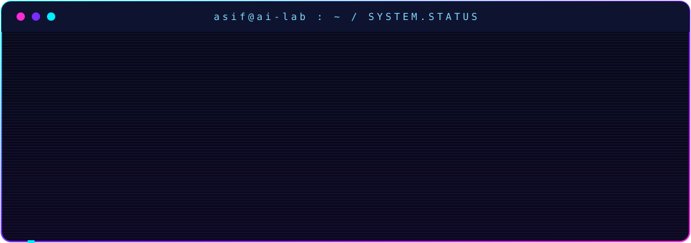

## ▸ About

AI / ML engineer focused on **LLM applications, retrieval-augmented generation, and secure system design**. Comfortable moving from a research idea to a deployable, containerized product, and from a statistical model to a working interface. A background in software engineering and game development adds full-stack and product delivery experience.

- MSc student in **Artificial Intelligence and Machine Learning** at Blekinge Institute of Technology
- Working on an AI-driven security vulnerability analyzer in a team project
- Studying university-level statistics and time series analysis
- Open to **AI / ML Engineer** opportunities

## ▸ Tech Stack

| Area | Tools and concepts |
|------|--------------------|
| **Languages** | Python, JavaScript (ES6), C#, C++, SQL, HTML5, CSS |
| **Machine Learning** | Supervised learning, classification, regression, feature engineering, imbalanced data handling, model evaluation, hyperparameter tuning, scikit-learn |
| **Deep Learning** | PyTorch, TensorFlow, Keras, neural networks, CNNs, transformers |
| **LLM and NLP** | LLM APIs, prompt engineering, retrieval-augmented generation, vector search, knowledge graphs, multi-agent workflows, text processing |
| **Data and Statistics** | pandas, NumPy, Matplotlib, Seaborn, Plotly, statistical modeling, time series analysis, Jupyter |
| **MLOps and DevOps** | Docker, Docker Compose, Git, GitHub, model deployment, Streamlit, container isolation |
| **Web** | React, Redux Toolkit, Node.js, Express, MongoDB, Vue, Vuetify, REST APIs |
| **Game Development** | Unity, C#, Firebase, AdMob, cross-platform builds (iOS, Android, PC) |

## ▸ Featured Projects

### [Security Vulnerability Analyzer](https://github.com/Asif-Khan-01/Security-Vulnerability-Analyzer)

An AI-assisted pipeline that finds security flaws in code repositories, judges each one in context with an LLM, and tries to prove the real ones inside a fully isolated sandbox.

- Six-stage scan pipeline that narrows hundreds of candidates down to a handful of proven findings
- Three-state results (confirmed, refuted, unverified) so analysts are never misled about certainty
- Three trust zones with a no-network sandbox, enforced by container networking
- Model gateway design, so switching from an external model to a self-hosted one is a configuration change

`Python` `Docker` `Vue` `LLMs` `RAG` `Static Analysis`

### [Asteroid Detection](https://github.com/Asif-Khan-01/Asteroid-Detection)

A machine learning project that detects asteroids from a dataset. Three classifiers were trained and compared, with class imbalance handled using imbalanced-learn and results served through a Streamlit web app.

| Model | F2-Score | Recall |
|-------|----------|--------|
| **Random Forest** | **0.9879** | **99.03%** |
| SVM | 0.7048 | 100% |
| Logistic Regression | 0.7033 | 100% |

Random Forest gave the best balance, catching about 99% of real asteroids with a far higher F2-score than the other two models.

`Python` `scikit-learn` `imbalanced-learn` `Streamlit` `Plotly` `Jupyter`

## ▸ Ventures

| Venture | Focus |
|---------|-------|
| **Liquid Forest** | Algae-based carbon capture with conversion into fuel |
| **PromptPlay Studio** | Cloud platform that generates Unity game projects from text prompts using a multi-agent AI system |

## ▸ Experience

**Software Engineer, Ifiasoft (Lahore)** | Sept 2023 to Feb 2024

- Built responsive interfaces with React, React Hooks, and React-Bootstrap
- Managed application state with Redux Toolkit for a scalable, maintainable codebase
- Used React Router and Axios for navigation and efficient data fetching

**Industrial Final Year Project, Mindstorm Studios**

- Designed and shipped hyper casual game concepts, lifting user engagement by 20% and monthly downloads by 15%
- Led a team of 3 developers, cutting project turnaround time by 30% and raising team productivity by 25%
- Adapted game mechanics across iOS, Android, and PC, growing the player base by 40%

**Security Analyzer Team Project**

- Member of a 10-person team delivering a security analysis tool for an industry client
- Weekly project reporting, scoping meetings, and requirement validation with the client
- Worked across LLM API integration, knowledge graph and RAG design, and architecture planning

## ▸ More Projects

| Project | Highlights |
|---------|------------|
| **Real Cricket Run** | Mobile game with a new probabilistic mechanic to improve player retention, Firebase and AdMob integration, optimized for low-end and high-end devices |
| **Netflix Web Application** | React streaming-style app with responsive design and React Router |
| **Login/Signup CRUD** | Secure authentication with Express, MongoDB, and Mongoose, with validation and error handling |
| **To-Do App** | Express and MongoDB app with RESTful CRUD endpoints and asynchronous updates |
| **Space Tourism Website** | React site with CSS animations and transitions |

## ▸ Education

- **MSc, Artificial Intelligence and Machine Learning**, Blekinge Institute of Technology (in progress)
- **BSc, Computer Science**, COMSATS University Islamabad, Lahore Campus

## ▸ Certifications and Achievements

- Winter GameJam Certificate, 2023
- TakeUp Entrepreneurship and Leadership Certification
- Executive Member, Google Developer Club (2021 to 2022)
- Executive Member, COMSATS Entrepreneurial Making Society (2020 to 2021)
- Executive Member, IEEE RAS (2022 to 2023)

## ▸ Let's Connect

