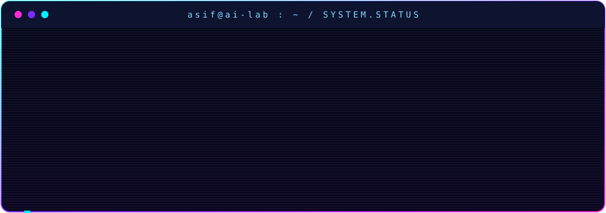

## ▸ About

AI / ML engineer focused on **LLM applications, retrieval-augmented generation, and secure system design**. Comfortable moving from a research idea to a deployable, containerized product, and from a statistical model to a working interface. A background in software engineering and game development adds full-stack and product delivery experience.

- MSc student in **Artificial Intelligence and Machine Learning** at Blekinge Institute of Technology
- Recent work: real-time sign language detection, hazardous asteroid detection and Bitcoin tweet sentiment analysis
- Working on an AI-driven security vulnerability analyzer in a team project
- Studying university-level statistics and time series analysis
- Open to **AI / ML Engineer** opportunities

## ▸ Tech Stack

| Area | Tools and concepts |
|------|--------------------|
| **Languages** | Python, JavaScript (ES6), C#, C++, SQL, HTML5, CSS |
| **Machine Learning** | Supervised learning, classification, regression, feature engineering, imbalanced data handling, model evaluation, hyperparameter tuning, scikit-learn |
| **Deep Learning** | PyTorch, TensorFlow, Keras, neural networks, CNNs, transformers |
| **LLM and NLP** | LLM APIs, prompt engineering, retrieval-augmented generation, vector search, knowledge graphs, multi-agent workflows, text processing |
| **Data and Statistics** | pandas, NumPy, Matplotlib, Seaborn, Plotly, statistical modeling, time series analysis, Jupyter |
| **MLOps and DevOps** | Docker, Docker Compose, Git, GitHub, model deployment, Streamlit, container isolation |
| **Web** | React, Redux Toolkit, Node.js, Express, MongoDB, Vue, Vuetify, REST APIs |
| **Game Development** | Unity, C#, Firebase, AdMob, cross-platform builds (iOS, Android, PC) |

## ▸ Featured Projects

### [Real-Time ASL Word Detection](https://github.com/Asif-Khan-01/Sign-Language-Detection)

Recognises 30 American Sign Language words live from an ordinary webcam. MediaPipe hand landmarks feed a Bidirectional LSTM that reads the motion of each sign.

- **71.3% test accuracy** across 30 classes (chance is 3.3%), mean F1 of 0.706
- Landmark-space augmentation lifted accuracy from about 48% to 71% with only ~20 videos per word
- Live inference with a rolling 30-frame window, prediction smoothing and a confidence threshold
- Lead developer in a 3-person BTH team

`Python` `TensorFlow` `MediaPipe` `OpenCV` `BiLSTM`

### [Hazardous Asteroid Detection](https://github.com/Asif-Khan-01/Asteroid-Detection)

Flags potentially hazardous asteroids among 958,000 records, where only 0.22% are hazardous. SMOTE plus undersampling handles the imbalance, and the F2 score puts catching hazards first.

| Model | F2 score | Recall | False alarms |
|-------|----------|--------|--------------|
| **Random Forest** | **0.988** | **99.0%** | **9** |
| Linear SVM | 0.786 | 100% | 563 |
| Logistic Regression | 0.703 | 100% | 871 |

`Python` `scikit-learn` `imbalanced-learn` `Streamlit` `Plotly`

### [Bitcoin Tweet Sentiment Analysis](https://github.com/Asif-Khan-01/SentimentAnalysis_Bitcoin_Tweets)

Sentiment analysis of ~50,000 Bitcoin tweets, combined with daily BTC-USD prices to test how far Twitter mood explains price direction.

- **BiLSTM sentiment classifier at 95.8% accuracy**, against 92.0% for a TF-IDF Logistic Regression baseline
- Random Forest analysis showed volatility and trading volume drive daily price direction far more than sentiment
- Interactive HTML dashboard of model results

`Python` `TensorFlow` `NLTK` `VADER` `scikit-learn`

### Security Vulnerability Analyzer *(private client project)*

An AI-assisted pipeline that finds security flaws in code repositories, judges each one in context with an LLM, and tries to prove the real ones inside a fully isolated sandbox. Built by a 10-person team at BTH for an industry client, in progress.

- Six-stage scan pipeline that narrows hundreds of candidates down to a handful of proven findings
- Three-state results (confirmed, refuted, unverified) so analysts are never misled about certainty
- Model gateway design, so switching from an external model to a self-hosted one is a configuration change
- Personal focus: LLM API integration, knowledge graph and RAG design, and architecture planning

`Python` `Docker` `Vue` `LLMs` `RAG` `Static Analysis`

## ▸ Ventures

| Venture | Focus |
|---------|-------|
| **Liquid Forest** | Algae-based carbon capture with conversion into fuel |
| **PromptPlay Studio** | Cloud platform that generates Unity game projects from text prompts using a multi-agent AI system |

## ▸ Experience

**Software Engineer (Frontend / Full-Stack), Thoughtworks** | Remote | Mar 2025 to Mar 2026

- Built scalable web applications for global clients with React, Redux and TypeScript in Agile teams
- Integrated REST and GraphQL APIs and delivered a client-facing fintech dashboard
- Reduced page load time by 15% through code splitting and lazy loading

**Frontend Engineer, Systems Limited** | Lahore | Mar 2024 to Feb 2025

- Built responsive, accessible interfaces for enterprise applications used by international clients
- Created reusable component libraries that sped up delivery across projects

**Open-Source Contributor, Google Summer of Code** | Remote | Jun 2024 to Aug 2024

- Delivered features, bug fixes and documentation merged into an open-source project

**Software Engineer, Ifiasoft** | Lahore | Sept 2023 to Feb 2024

- Built interfaces with React Hooks and React-Bootstrap, with state managed in Redux Toolkit
- Used React Router and Axios for navigation and data fetching

**Unity 3D Developer (Contract), Mindstorm Studios** | Lahore | Feb 2023 to Feb 2024

- Designed and built hyper-casual games for iOS, Android and PC, and led a team of 3 developers
- Integrated Firebase and AdMob and optimised performance for low-end devices

**Security Vulnerability Analyzer, Team Project at BTH** | 2025 to present

- Member of a 10-person team building an AI-driven security analysis tool for an industry client
- Weekly reporting, scoping meetings and requirement validation with the client

## ▸ More Projects

<b>Earlier web and game projects</b>

 

| Project | Highlights |
|---------|------------|
| **Real Cricket Run** | Mobile game with a probabilistic mechanic to improve player retention, Firebase and AdMob integration |
| **Netflix Web Application** | React streaming-style app with responsive design and React Router |
| **Login/Signup CRUD** | Authentication with Express, MongoDB and Mongoose, with validation and error handling |
| **To-Do App** | Express and MongoDB app with RESTful CRUD endpoints |
| **Space Tourism Website** | React site with CSS animations and transitions |

## ▸ Education

- **MSc, Artificial Intelligence and Machine Learning**, Blekinge Institute of Technology, Sweden (Aug 2025 to Jun 2027)
- **BSc, Computer Science**, COMSATS University Islamabad, Lahore Campus

## ▸ Certifications and Achievements

- Winter GameJam Certificate, 2023
- TakeUp Entrepreneurship and Leadership Certification
- Executive Member, Google Developer Club (2021 to 2022)
- Executive Member, COMSATS Entrepreneurial Making Society (2020 to 2021)
- Executive Member, IEEE RAS (2022 to 2023)

## ▸ Let's Connect

